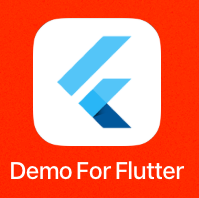

# SpeechSuper SDK for Flutter

# Getting Started

## Step 1: Download the SpeechSuper SDK for Flutter

Download the SpeechSuper SDK for Flutter from the following link:

[Download SpeechSuper SDK](https://drive.google.com/file/d/1uZD096SFQoxay9bcOH5KlVvLGFl9SYt6/view?usp=drive_link) 

## Step 2: Setting up the Demo

### 1. Insert your AppKey and SecretKey

Open the file `lib/eval_screen.dart` and add your `appKey` and `secretKey` in line 29 and 30 respectively.

### 2. Get the dependencies

Run `flutter pub get` in the demo folder to install dependencies.

### 3. Connect to your device and run the demo
Once your device is connected to your computer, run `flutter run`. You'll see a new app icon on the screen. 

## Step 3: Running the demo

#### 1. Click to enter the speech assessment interface:

#### 2. Initilize:

Enter the `coreType` and `refText`, then click the "Initialize the Engine" button. You will receive a success message. 

#### 3. Start and stop recording:
Click the "Start Evaluation" button to start recording and click the "Stop Evaluation" button to stop recording. The assessment results will be displayed. 

#### 4. Additional functions:

- **Cancel Evaluation:** You can cancel the speech assessment during recording.  
- **Playback Recording:** Replay the audio recorded just now.  
- **Current Recording Path:** Display the audio path recorded just now.  
- **Delete Evaluation Engine:** Delete engine instance after completion of speech assessment. 

